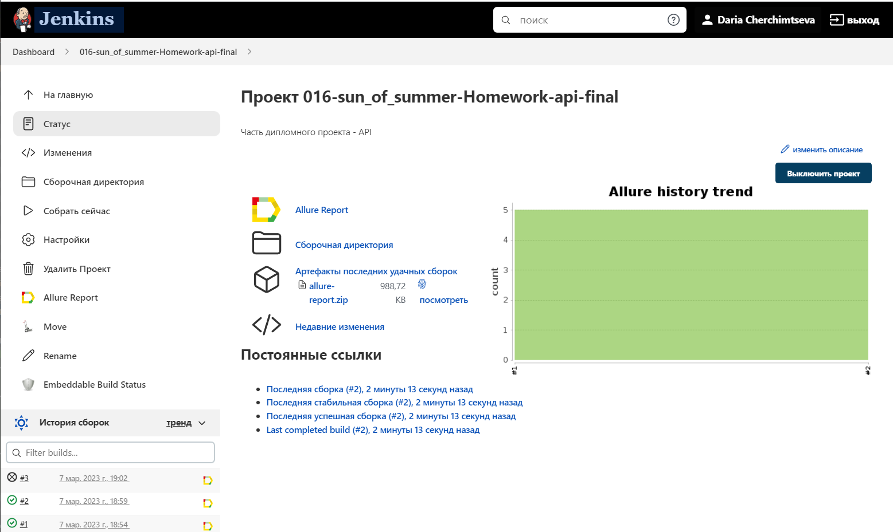
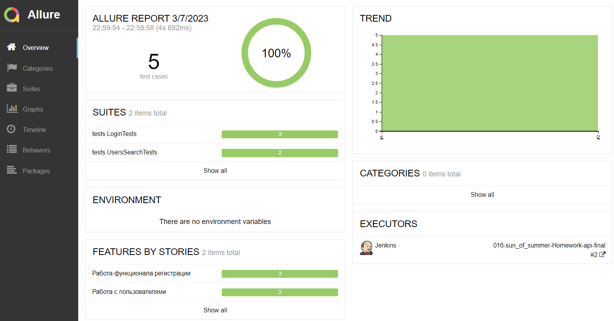
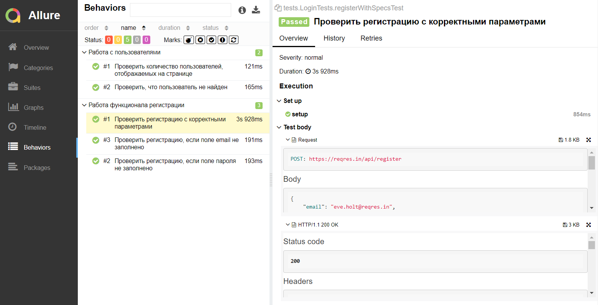
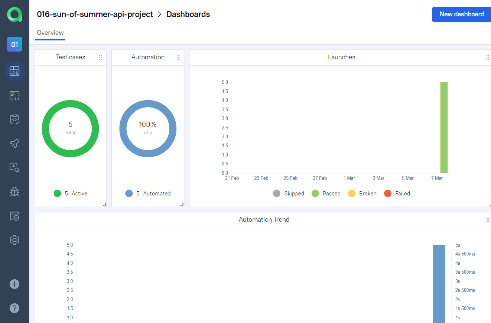
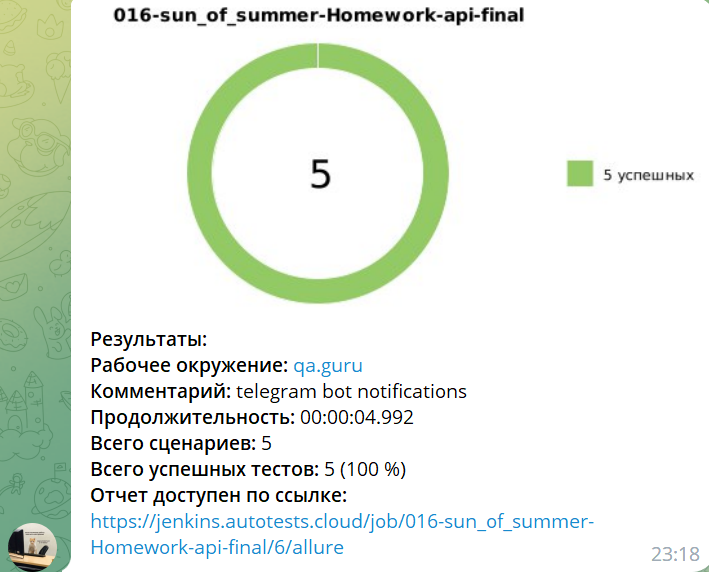

## Автотесты для API на сайте [reqres.in](https://reqres.in/)
### Технологический стек
________
                           

-----
* Написаны на ``Java`` с использованием фреймворка для модульного тестирования ``JUnit 5`` 
* ``Gradle`` используется для автоматизированной сборки проекта
* Удаленно тест запускается с помощью сервера``Jenkins``
* Система ``Allure Report`` формирует отчет о запуске тестов
* Интеграция с ``Allure TestOps``
* ``Telegram``-бот отправляет уведомление о результатах прохождения тестов

###  Содержание тестов:
1. проверка работы с пользователями
2. проверка работа функционала регистрации

###  Сборка для запуска тестов в [Jenkins](https://jenkins.autotests.cloud/job/016-sun_of_summer-Homework-api-final/) 

  

###  Отчёт о прохождении тестов доступен по клику на иконку **"Allure Report"**  

   

   

###  Интеграция с [Allure TestOps](https://allure.autotests.cloud/project/1970/dashboards)

###  Уведомления о прохождении тестов в Telegram  

  
